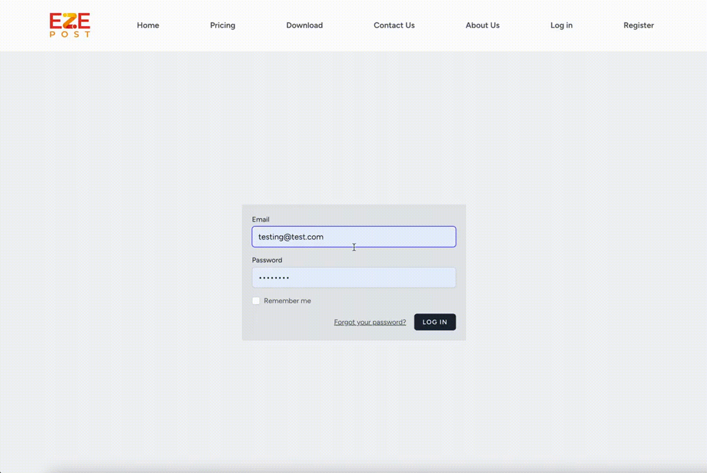
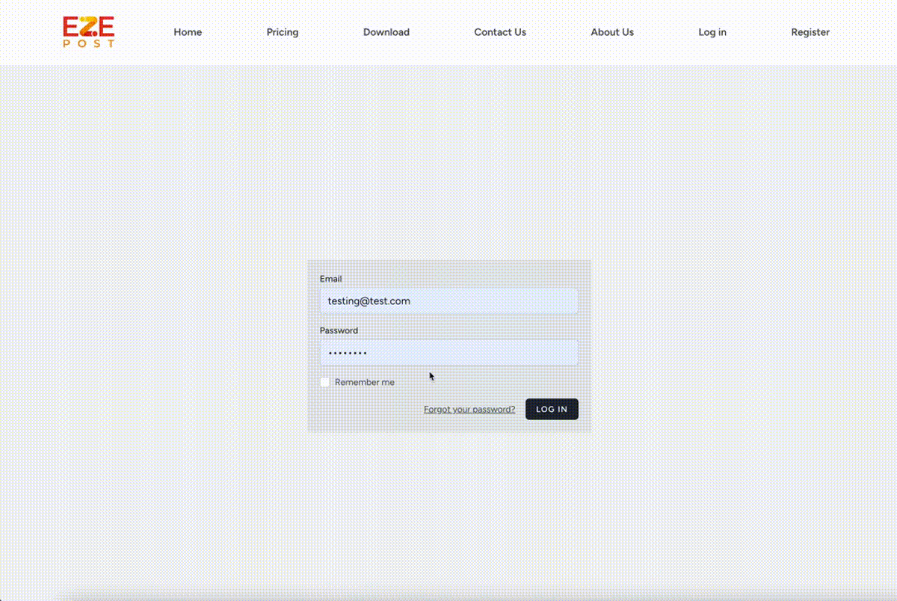
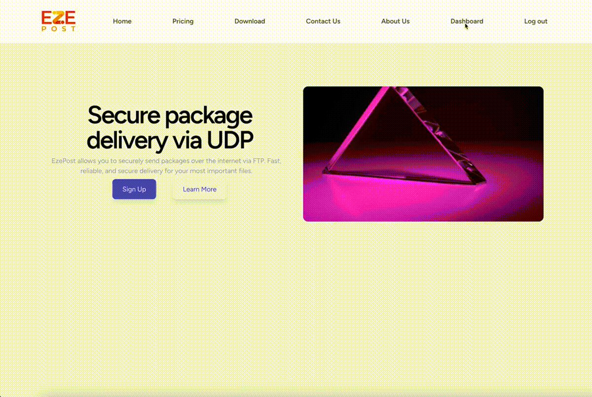
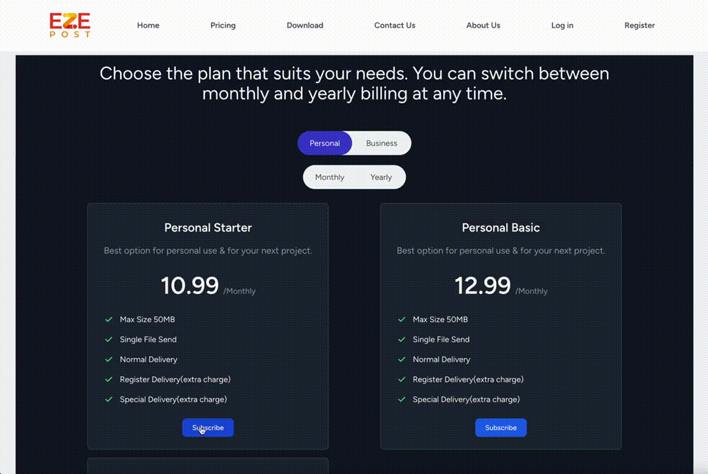
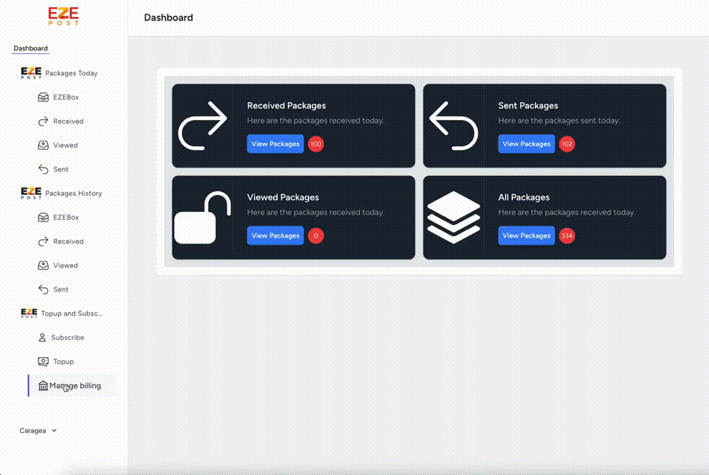
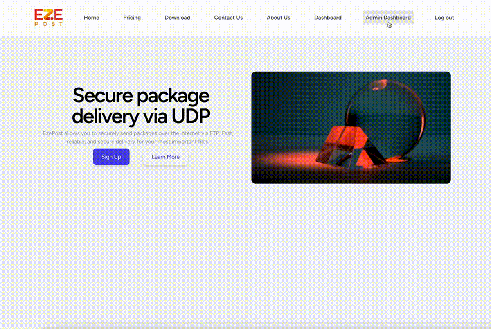

# Laravel Application

-   Development of a PHP Laravel web application with Stripe payment integration.
-   Platform for individuals and organizations to transfer files securely using the EZE POST desktop application.
-   Web application features:
    -   User registration.
    -   Subscription management.
    -   Receipt generation.
    -   Customer portal integration with Stripe for payment processing.
-   Separate admin and customer areas with distinct functionalities tailored to their roles.
-   Emphasis on modern design, robust security measures, and scalability.
-   Ensures a seamless and secure file transfer experience for users.

## Getting Started

To get started with this application, follow these steps:

1. Clone this repository to your local machine:

```
git clone https://github.com/CarageaAlexandru/EzePost.git
```

 2. Create a `.env` file by copying `.env.example` and configure your environment variables:
```
cp .env.example .env
```
3. Generate application key:
```
php artisan key:generate
```
4. Migrate the database:
```
php artisan migrate
```
5. Serve the application:
```
php artisan serve & npm run dev
```
6. Visit `http://localhost:8000` in your browser to view the application.
## Features

-   **Authentication**: The application provides user authentication with login, registration, and logout functionalities.

    
    
-   **Profile Management**: Users can manage their profiles including editing and deleting their profiles.

    

-   **Package Management**: Users can view all packages, sent packages, received packages, and viewed packages with Pagination implemented.

    

-   **Subscription Management**: Users can subscribe to various packages, and manage their subscriptions via Stripe API.
    
    

-   **Manage Billing**: Users can manage their billing details including updating their payment method and viewing their billing history.

    
- 
-   **Admin Dashboard && Management**: Administrators have access to an admin dashboard where they can manage users, subscriptions, prices, and more.

    

-   **Receipt Generation**: Admin can generate receipts for their packages.

    
    
-   **Static Pages**: The application includes static pages such as Home, Pricing, Contact, and About.

## Controllers

This application has several controllers handling different functionalities:

-   **DashboardController**: Handles dashboard related functionalities including retrieving package counts and rendering the dashboard view.
    
-   **PackagesController**: Manages the retrieval of packages based on different types (all, sent, received, viewed).
    
-   **PricingController**: Retrieves all available plans and renders the pricing page view.
    
-   **ReceiptController**: Manages the generation and display of receipts for packages.
    
-   **SubscriptionController**: Handles subscription-related functionalities including checkout, success/cancelled pages, webhooks, and customer portal.
    
-   **AdminController**: Provides functionalities for the admin dashboard including displaying customer statistics, managing plans, and updating plan details.
